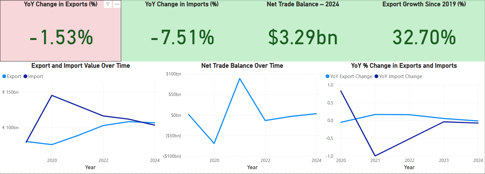
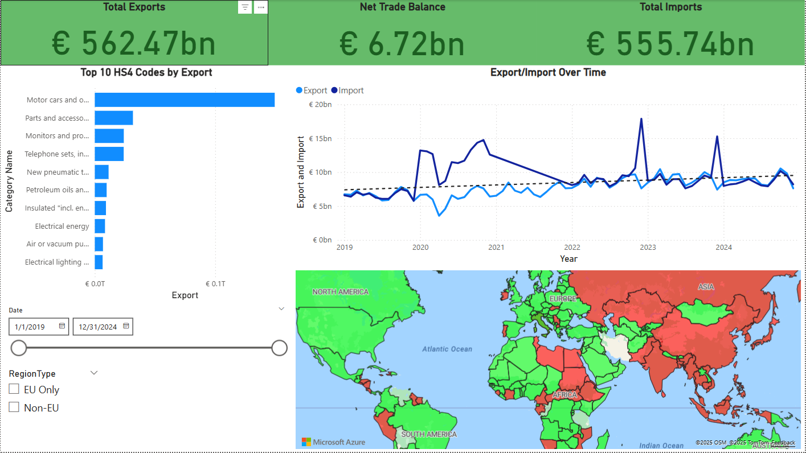
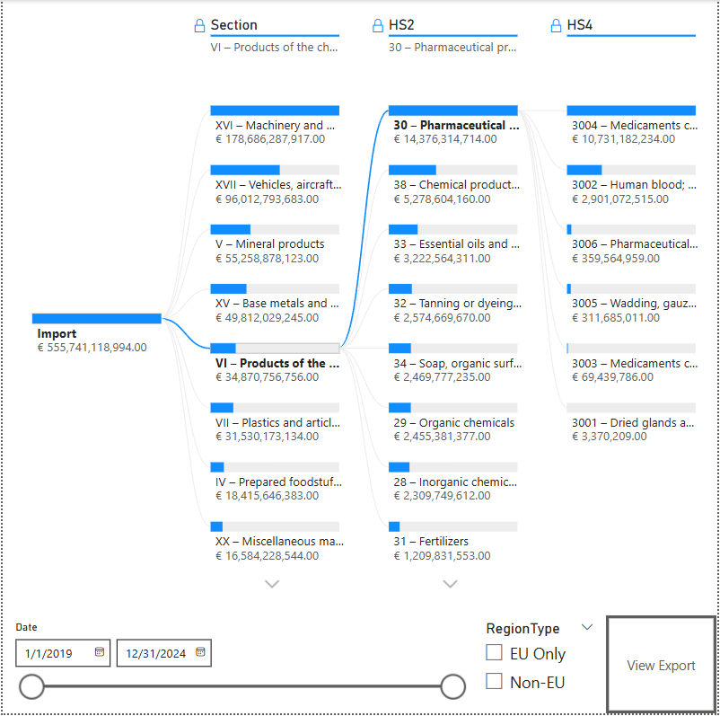

# EU Trade Dashboard (2019–2024)
[](https://powerbi.microsoft.com/) [](https://opensource.org/licenses/MIT)


## Table of Contents
- [Project Description](#project-description)
- [Project Motivation](#project-motivation)
- [Tools & Technologies Used](#tools--technologies-used)
- [Feature Overview](#feature-overview)
- [Filters and Slicers](#filters-and-slicers)
- [Data Model & Measures](#data-model--measures)
- [How to Use](#how-to-use)
- [Insights & Observations](#insights--observations)
- [Limitations](#limitations)
- [Future Improvements](#future-improvements)
- [Repository Structure](#repository-structure)
- [Author](#author)
- [License](#license)
- [Disclaimer](#disclaimer)
- [Screenshots](#screenshots)


## Project Description
This Power BI dashboard provides a comprehensive overview of monthly EU trade performance between 2019 and 2024, simulating real trade patterns across countries, regions, and product categories using the HS2 and HS4 code classifications.

---

## Project Motivation
This dashboard was developed as a university data visualization project with the aim to build an interactive tool that mimics a real-world trade analytics solution. The goal was to explore how policy makers, analysts, or students could monitor trade flows, understand economic trends, and identify key exporting/importing countries and items.

---

## Tools & Technologies Used
- Power BI Desktop (2025)
- DAX – for KPI calculations, share %, YoY deltas, and tooltips
- Power Query (M) – for data shaping and transformation
- Simulated Dataset – based on realistic EU trade patterns and HS codes
- Star Schema – optimized for fast filtering, joins, and drilldowns

---

## Feature Overview

### Homepage Navigation
- Button-based UI for switching between pages
- Organized into Imports, Exports, KPIs, Country Explorer, and Composition Explorer

### Import/Export Summary Pages
- Total trade volume, import/export share
- Year-over-year trend lines
- Top 10 traded HS4 categories

### Trade KPIs and YoY Trends
- Growth since 2019 (%)
- Trade balance (€)
- Line graphs for import/export change over time

### Country Profile Explorer
- Select a country to view trade stats, charts, and top categories
- Map tooltips with export/import breakdowns

### Composition Explorer (HS2/HS4)
- Tree visual breakdown by HS section, HS2, HS4
- Supports filtering by year, country, region

---

## Filters and Slicers
- Date Range (2019–2024)
- RegionType (EU Only / Non-EU)
- RegionGroup (Asia, US, EU, Other)
- Country & Year selectors
- All charts dynamically update based on the selected filters

---

## Data Model & Measures

### Schema
- Fact Tables: fImport, fExport
- Dimension Tables: dimCountry, dimDate, dimHS2, dimHS4, dimRegionType
- Measures Table: Centralized KPIs organized by folders (e.g. KPIs_Export, Trade Balance, YoY, etc.)

### Measure Examples
- Total Import/Export (EUR)
- Trade Balance = Export - Import
- YoY Change % (DAX)
- Import/Export Share by Region

---

## How to Use
To interact with the dashboard:
1. Download the `.pbix` file from this repository.
2. Open in Power BI Desktop (version 2023 or later).
3. Use the slicers on each page to filter by country, year, category, or region.

---

## Insights & Observations
- Germany is both the top importer and exporter, highlighting its central role in EU trade.
- Non-EU partners like China and the USA appear consistently in high-value trade relationships.
- Vehicles and machinery dominate export categories, while electronics and energy-related imports show consistent volume.

---

## Limitations
- Data used is fully simulated — no official Eurostat/UN Comtrade sources.
- Currency effects and inflation not modeled.
- Lacks drillthrough capabilities for detailed transaction-level view.

---

## Future Improvements
- Connect to real trade APIs (e.g. Eurostat bulk download)
- Add drillthrough reports per country or product
- Create paginated PDF export with KPIs for executive summary

---

## Repository Structure
```
EU-Trade-Dashboard/
├── images/                       # Key screenshots from the dashboard
│   ├── overview.png
│   ├── kpi_trends.png
│   └── hs4_tree.png
├── EU_Trade_Dashboard.pbix       # Power BI project file
├── LICENSE                       # MIT license file
├── README.md                     # Project documentation

```

---

## Author
Filip Vitko – 2025  
Student of Pan-European University, Faculty of Informatics

---

## License
This project is licensed under the MIT License.

You are free to use, modify, and distribute this project for personal or commercial purposes, provided that proper credit is given to the original author.

---

## Disclaimer
This dashboard uses **simulated data** inspired by publicly available EU trade structures (e.g. HS codes). No proprietary or restricted datasets (such as those from Eurostat or UN Comtrade) are directly embedded or distributed.

---

### Screenshots

**KPI Overview and Year-over-Year Trends**  


**Export / Import Overview with Map and Categories**  


**HS4-Level Import Breakdown**  


